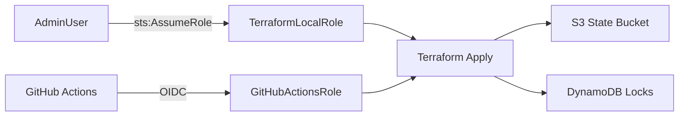

# 00-bootstrap

Creates the foundational infrastructure required by all other modules. Uses **local state** — must run before any other module.

## What it creates

| Resource | Purpose |
|---|---|
| S3 Bucket (versioned + encrypted) | Terraform remote state storage |
| DynamoDB Table | State locking (prevents concurrent applies) |
| S3 Bucket | CloudTrail logs |
| CloudTrail (multi-region) | Full API activity audit trail |
| IAM AdminUser | Personal admin access (never use root) |
| IAM Role: TerraformLocalRole | Role assumed by AdminUser for local Terraform runs |
| IAM Role: GitHubActionsRole | OIDC role assumed by GitHub Actions (no static credentials) |

## Architecture



## Usage

```bash
mise run bootstrap
```

## After running

1. Note the outputs:
   ```bash
   terraform -chdir=00-bootstrap output
   ```
2. Replace `ACCOUNT_ID` in each module's `versions.tf` with your account ID
3. Add `github_actions_role_arn` output as `AWS_ROLE_ARN` secret in GitHub
