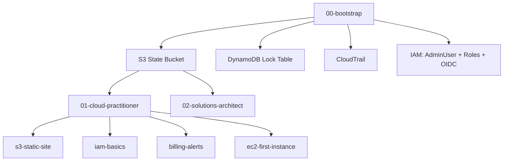

# AWS Certification Portfolio

Infrastructure as Code portfolio demonstrating AWS skills through Terraform, organized by certification level.

## Architecture



## Structure

| Directory | Description |
|---|---|
| `00-bootstrap/` | State backend, CloudTrail, IAM baseline — runs first with local state |
| `01-cloud-practitioner/` | Foundational AWS services for Cloud Practitioner |
| `02-solutions-architect/` | Multi-tier architectures for Solutions Architect Associate |

## Prerequisites

- [Mise](https://mise.jdx.dev) installed
- AWS account with root access (to run bootstrap)
- GitHub repository secrets configured (see below)

## Getting Started

### 1. Install tools

```bash
mise install
```

### 2. Configure AWS credentials

```bash
aws configure
```

### 3. Run bootstrap (creates S3, DynamoDB, CloudTrail, IAM)

```bash
mise run bootstrap
```

### 4. Update backend configuration

After bootstrap, replace `ACCOUNT_ID` in each module's `versions.tf` with your AWS account ID from the bootstrap output.

### 5. Configure GitHub Secrets

Add to your repository secrets:

| Secret | Value |
|---|---|
| `AWS_ROLE_ARN` | Output `github_actions_role_arn` from bootstrap |

### 6. Work with modules

```bash
mise run tf:init  01-cloud-practitioner/s3-static-site
mise run tf:plan  01-cloud-practitioner/s3-static-site
mise run tf:apply 01-cloud-practitioner/s3-static-site
```

## CI/CD Pipeline

- **Pull Requests** → `terraform plan` runs automatically and posts results as PR comment
- **Merge to main** → `terraform apply` runs automatically on changed modules

## Available Tasks

| Task | Description |
|---|---|
| `mise run bootstrap` | Run 00-bootstrap from scratch |
| `mise run tf:init <module>` | Initialize a module |
| `mise run tf:plan <module>` | Plan changes |
| `mise run tf:apply <module>` | Apply changes |
| `mise run tf:fmt` | Format all Terraform files |
| `mise run tf:validate` | Validate all modules |

## Standards

- Terraform `~> 1.9` · AWS Provider `~> 5.0`
- State: S3 + DynamoDB locking per module
- Auth: OIDC (no long-lived credentials)
- Linting: tflint · Security: checkov
- All resources tagged with `Owner`, `ManagedBy`, `Project`, `Certification`, `Module`
